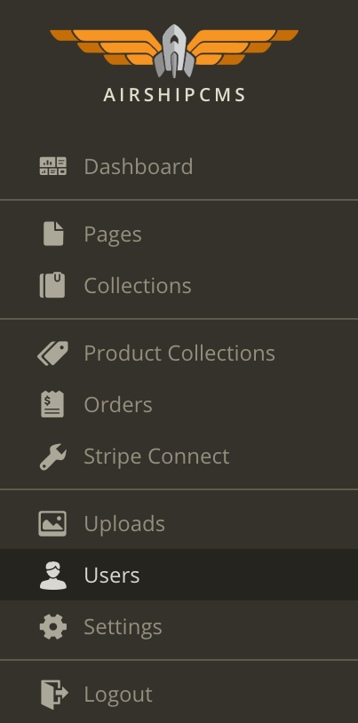

# Airship Phaser Project

## Contents

* [**Description**](#description)
* [**Setup**](#setup)
* [**Documentation**](#documentation)
    * [Project Directory Structure](#project-directory-structure)
    * [Adding Game Assets](#adding-game-assets)
    * [Serving Your Game Locally](#serving-your-game-locally)
    * [Launching Your Game](#launching-your-game)
    * [AirshipCMS Admin Portal](#airship-cms-admin-portal)
    * [Airship CLI](#airship-cli)

---

# Description

This project documents how to setup your Phaser game with Airship.

---

# Setup

### 1. [ Airship Login ](#airship-login)

- In your terminal, navigate to your project directory.

- Run `airship login projectname`, where projectname is the airship subdomain of your project.
  
  

- After running `airship login projectname`, you will be informed that you aren't in an Airship CMS project. You will be asked if you would you like to set the current directory as the Airship CMS project root for your site.

- Enter `yes`or `y`.

  

- Enter your Airship credentials. 

  

### 2. [ Airship Land ](#airship-land)

- In your terminal, run `airship land`.

  

- This will pull down all necessary Airship config files and initial project structure. You will be asked if you want to download compartments to your project.

- Enter `yes` or `y`.

  

### 3. [ Airship Serve ](#airship-serve)

- In your terminal, run `airship serve`.

  

- This starts the server that will render all of your project files locally. 

- Open your browser and navigate to `http://localhost:9001`. The page should look like the image below.

  

- The content you see on this page is rendered by the template `/compartments/templates/root.html`, which is then injected into the layout `/compartments/layouts/application.html`.

- In your project, navigate to `/compartments/layouts/`. In this directory, open `application.html`.

  

- In application.html, you will see a basic "container" for a rendered page. You can add global `<head>` content (such as links to stylesheets and global scripts), and optionally add global markup inside `<body>` that you want to render on every page. `{{{ template }}}` renders the template specified by the CMS. For a phaser game, we only need the main page, which is rendered by the `root.html` template from `/compartments/templates/`.

- In your project, navigate to `/compartments/templates/`. In this directory, open `root.html`. There will be some markup in this template. You won't need any of it for your phaser project, so delete all of it. Add a simple `<h1>Hello World!</h1>` and Save the file.

  

- Reload `localhost:9001` to check that your changes updated. 

  

- Now you're ready to go!

---

# Documentation

### Project Directory Structure

- This is your project directory structure.

  

- For your Phaser project, you will be using the `assets`, `layouts`, and `template` directories.

### /assets
- The assets directory contains 3 subdirectories: `scripts`, `styles` and `media`.

  - `/scripts:` This directory may only contain scripts and text-based files (examples: .js, .xml, .json, .html). Do not put any binary files here. They will be rejected when you launch your project. Maximum file size is 5M. For this project, this will contain Phaser and game scripts. 

  - `/media`: This directory may contain scripts, text files, and any other media such as images, music, sound effects, etc (.png, .jpg, .mp3, etc). Maximum file size is 10M.

  - `/styles`: This directory contains styles (.css).

- Do not add any other directories or files immediately inside of `/assets`. The `/scripts`, `/styles` and `/media` directories may have any number of subdirectories.

**File Paths**: When linking to files in assets, paths should look like: `/assets/scripts/filename.js` or `/assets/media/filename.png`.

### /layouts
- The layouts directory mirrors the layout that is set for the page in the Airship CMS Portal.

  - `application.html`: This is the default layout. The layout typically includes global links to your media, scripts and styles, and any markup that should appear on all pages of your project.

### /templates
- The templates directory mirrors the template that is set for the page in the Airship CMS Portal.

  - `root.html`: This is the default layout. The template includes markup specific to a single page of your project.

- In this project, the layout used is `application.html` and the template used is `root.html`. You can change these file names or create new pages, layouts and templates, as long as they are also linked to the appropriate pages in the setup section of the Airship CMS Portal. Use either `application.html` or `root.html` to link to your assets, depending on where and when you want scripts to load.

---

## Adding Game Assets

### 1. Add your scripts:

  - In your project, navigate to `/compartments/assets/scripts/`.

  - Add your game scripts.

  

  - Add your script files to the body of `/compartments/layouts/application.html` and update the `<title>` with your project title.
  
  

### 2. Add your media:
  - In your project, navigate to `/compartments/assets/media/`.

  - Add your game images, music, sfx, etc.

  

### 3. Add your styles:
  - In your project, navigate to `/compartments/assets/styles/`.

  - Add your css files to the head of `/compartments/layouts/application.html`.

  

---

## Serving Your Game Locally

### [Airship Serve](#airship-serve)

  - If you aren't already running the `airship serve` command, then in your terminal, run `airship serve`.

  

  This starts the server that will render all of your project files locally.

  - Open your browser and navigate to `http://localhost:9001`. To view any changes made to your game files, refresh this page.

* If you encounter this error while attempting to serve, [log in](#airship-login) to your Airship project then try again.

--

### Launching Your Game

### [Airship Launch](#airship-launch)

- In your terminal, run `airship launch`.

  

- This will ask you to upload compartments. This will overwrite everything on the server.

  
  Enter `yes` or `y`.

- Open your browser and navigate to `projectname.airshipcms.io`.

- If you encounter this error while attempting to launch, [log in](#airship-login) to your Airship project then try again. 

  

- If you encounter an error like this while attempting to launch, you may have added a file type to the wrong directory or the file type you have added is unsupported. Please refer to the [Project Directory Structure](#project-directory-structure) section. 

  

- If you encounter an error like this, or another error about your `manifest` needing to be updated, while attempting to launch, your `manifest` may be out of sync with your local files. The `manifest` simply tracks differences between files in your local development workspace and the server. The `manifest` may sometimes be out of sync when there are `launch` or `land` errors, or if you have multiple people working on a project. Simply run `airship manifest` if prompted, and say `y` to generate the manifest file. This is not desctructive. No files or assets will be overwritten with this action. 

  

---

### AirshipCMS Admin Portal

### Login

- In your browser, navigate to `http://projectname.airshipcms.io/admin`.

  

  If you haven't already logged into the admin portal, you will be redirected to the login page.

  Enter your credentials.

### Users

- Click `users` in the sidebar.

  

- This page displays a list of users existng on this site.

 

- To add a new user, click on the `New User` button located in the top right corner.

 

- On this page, you'll see a form that requires your new user's `email`, `password`, `password confirmation` and `user type`.
 

 There are 4 user types: `superadmin`, `admin`, `user` and `noaccess`.
 

 If the new user will be running Airship commands like `airship serve` or `airship launch`, you will need to set them as `admin` or `superadmin`.

 After adding your new user, he or she may log into the admin portal and into the project by running `airship login projectname` in their terminal.

- To edit an existing user, click the pencil icon attached to the user.

  

  - On this page, the selected user's `email`, `password` and `user type` can be changed.

  	

  	There is also an option to delete the user.

  	Only a `superadmin` has access to edit another `superadmin`.

### Pages

- Click `pages` in the sidebar.

 

 This page lists all of your site's existing pages.

 Your site was initialzed with `Landing Page`.

 This page links to `/compartments/templates/` and `/compartments/layout/` of your project.

 

 A superadmin user will see options to create a new page and edit or modify an existing page. An admin is only granted access to edit existing pages.

 #### Modify

 - click on the wrench icon of the page you want to modify.

 - ##### Page Setup

  

  This section displays the pages's title, permalink, ID, when it was created and when it was last updated.

 - ##### Page Layout & Template.

   	
	
   	This section lets you create/select the layout and template that this page will used.
	
   	This page is using the initial Airship config files that we've pulled down to our project using `airship land`.
	
   	Layout files must go into `/compartments/layouts/` of your project.
	
   	Template files must go into `/compartments/templates/` of your project.

 - ##### Page Fields
 
   

   Here, you'll find a list of predefined fields: `ID`, `Created At`, `Updated At` and `Title`. These fields cannot be edited.

   Page fields can be used from your project.

   You can add more fields to your page.

   If you wanted to add game instructions to your page, start by filling in the title of your new field. For this example, the title "How to Play".

   

   The variable name will be filled automatically. This variable will be used to access it from your template later on.

   You can set the type of your page field.

   

   Types include: `text`, `textarea`, `richtext area`, `image`, `file`, `link`, `number`, `radio`, `select`, `multiselect`, `checkbox`, `list of images`, `list of files`, `  list of links`, `related aerostats` and `date`.
  
   `text` was selected for this example.
  
   Click the `Add New Field` button.
  
   You should see your new field listed under Page Fields.
  
   
   
  
   Click the `Modify Page` button located in the bottom and top right corners of the page.

   

 #### Edit Page

 - To edit a page, click on the pencil icon.

  

 - You can see all of your page fields here.
  

 - You can change the value of any field.

 - Edit the value of the `How to Play` field that was created earlier.

  

 - Click the `Save & Close` button located in the top or bottom right corner.

   

 - To use this new field on your site's page, go to `/compartments/templates/root.html` in your project.

 - Add your field: `{{ fields.variable_name }}`.

   

 - If your server is running, navigate to `http://localhost:9001` in your browser.

   

   You should now see your field on your page!

 - If you forget your field's variable name, you can add `{{{ help }}}` to your template.

   This will render a list of all your fields.

---

## [Airship CLI](#airship-cli)

### List all airship commands
This lists all airship cli commands.

```
airship
```

### airship login 
- Log in to your project with your _superadmin_ access level *email*, your *password*, and your AirshipCMS *subdomain*.  
```
airship login projectname
```
- *projectname* is the subdomain for your project. If your airshipcms.io project subdomain is "marketing.airshipcms.io", you would enter `airship login marketing` or `airship login marketing.airshipcms.io`.

- This will connect you to the airship server for the project globally on your computer. If you have landed the project in more than one location, logging in will open the connection to airship for the project in all those locations.

### airship land
- Do this the *first time you work on the project*. This pulls down necessary Airship config files and initial project structure. After the first time, you should have all your files frequently backed up in Git, so you will never really have to run _airship land_ anymore, and you can simply create and launch your new files without ever landing again.  
```
airship land
```
- If for some reason you want to pull down the files that are live, you can run airship land again. *Be sure you have backed up your local files* because airship land will overwrite them.

### airship serve
- Airship serve runs the server that will locally render layouts, templates, and pull content from Airship CMS. Keep this runnind in a dedicated a terminal tab, and use other tabs to run other airship commands and other project processes.

```
airship serve
```

### airship launch
- When you are ready to launch your local changes to production, run *airship launch*. This will overwrite all files on the server to match your local project structure. If you have added files locally, they will be added to the server. If you have deleted files locally, they will be deleted from the server.
```
airship launch
```
- If for some reason you need to back up the state of production compartments, then *airship land* files in a separate directory, or better yet, you already have them backed up in a different branch using your source code management tool.

### airship upgrade
- If the launcher notifies you that an update is available for the launcher, run this command.
```
airship upgrade
```

### airship logout
```
airship logout
```
- Note: `airship logout` disconnects you from the airship server for the project globally on your computer. If you have landed the project in more than one location, logging out will close the connection to airship for the project in all those locations.

----

## Source Code Management
- If you are using a source code management tool, you will probabaly only need to `airship land` the first time you set up the project. If your code is safely committed, you may occasionally want to run `airship land` to investigate diffs between local and production files. 
Be sure to `.gitignore` your `bower_components and node_modules`. It is also safe to .gitignore the `.airship` directory of your project.
